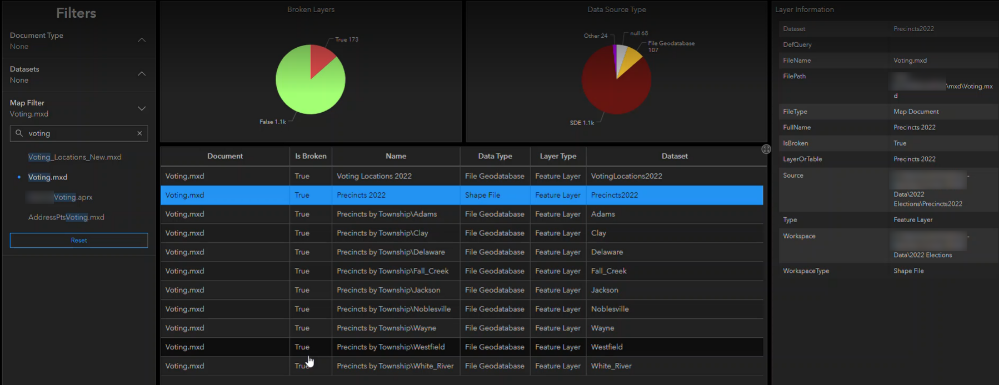

# CGS_GIS_Utilities
The GIS Utilities package contains models and scripts to be used in [ArcGIS Pro](https://www.esri.com/en-us/arcgis/products/arcgis-pro/overview). These utilities allow GIS administrators to catalog and manage their GIS environments. There are cataloging tools for your local GIS and ArcGIS Portal. Cataloging generates a report that contains useful information such as: paths to your documents and source data, as well as determining whether or not the data is working or broken. Using the Publish Reports script, these results can be publish to ArcGIS Online or ArcGIS Enterprise and used withing maps and dashboards.

ArcGIS Dashboards are great tools for monitoring your GIS environments (example screenshot below). At a glance, they can provide you with insights that give you the information needed to take action when necessary. For example, you can create an interactive chart that you can click to display which layers are broken. From there, you can dive deeper to get to the root of the problem. Maybe a password for your SDE has been changed? Or maybe a server or folder was renamed. Once the problem is corrected, simply re-run the report and publish the new results to ArcGIS Online.



## Sections
* [Requirements](#requirements)
* [Features](#features)
* [Installation](#installation)
* [Usage](#usage)
* [Resources](#resources)
* [Issues](#issues)
* [Contributing](#contributing)
* [Licensing](#licensing)

## Requirements
* ArcGIS Pro 2.1 (or later)

## Features
GIS utilities such as toolboxes, scripts, and models including:
* The [**cgs_examples**](./cgs_examples) folder contains:
	* CGS Examples.atbx

		
* The [**cgs_utilities**](./cgs_utilities) folder contains:
	* EmptyProProject
	* images
	* scripts
	* CGS Utilities.atbx

		
* The [**loggis.py script**](./cgs_utilities/scripts/logGis.py). Manual configuration is necessary.

## Installation

### Download the toolbox

1. Download CGS_GIS_Utilities from Github.
	* If you download a .zip, extract it.

### Connect the toolbox
1. Create or open an ArcGIS Pro project.
2. Add CGS Utilities.atbx to the project.
3. Begin building your custom models.
	* NOTE: See CGS Examples.atbx for example models using the utilities.

## Usage

### Catalog Projects Script
*This script allows you to catalog ArcMap .mxd projects and ArcGIS Pro .aprx projects. The report generated is a .csv file.*

**NOTE:** *View the script's metadata for additional information, or click the i for specific parameter usage*


### Catalog Portal Script
*This script allows you to catalog their Portal. The report generated is a .csv file.*

**NOTE:** *View the script's metadata for  for additional information, or click the i for specific parameter usage.*


### Publish Report Script
*This script allows you publish a .csv file to ArcGIS Online as a table (no geometry).*

**NOTE:** *View the script's metadata for  for additional information, or click the i for specific parameter usage.*


### Optional: logGis Implementation
*The logGis.py script allows users to log their scripts to a local .log file as well as an ArcGIS Online table. This is useful for keeping a close eye on all of your scheduled utilities.*

**NOTE:** The first time you run a tool with logGis implemented, a feature layer (table) gets created in your ArcGIS Online or Portal.

**EXAMPLE:** See the [**catalogProjects_logGis.py script**](./cgs_utilities/scripts/catalogProjects_logGis.py) for an implementation example.	
1. Update the loggis_config.json with authentication parameters if necessary. (It's configured to authenticate with the active ArcGIS Pro account by default.)
2. Import the logGis.py to the script you want to log.
```r
import logGis
```
3. Instantiate the logGis object.
```r
loggis = logGis.LogGIS(__file__, "Cataloging Projects")
```
4. Set the start info. This will update the AGO table with the time the tool started.
```r
loggis.SetStartInfo()
```
5. Add DEBUG, INFO, and ERROR logging where necessary.
```r
loggis.logger.debug(f'Cataloging Document {fullPath}')
loggis.logger.info(f'script {loggis.ScriptFullPath} started.')
loggis.logger.error(f"ERROR @ Line {tb.tb_lineno} in file {__file__} with error: {sys.exc_info()[1]}")
```
6. Finally, set end info in the AGO table, send an email if errors are detected, and clear the logging.
```r
loggis.SetEndInfo()
loggis.emailLog()
loggis.logger.info(f'script completed.')
loggis.CompleteLogging()
```

## Resources
* ESRI [help](https://pro.arcgis.com/en/pro-app/latest/help/analysis/geoprocessing/basics/what-is-geoprocessing-.htm) for Geoprocessing.
* Need help integrating scripts into models? See [ESRI's help docs](https://desktop.arcgis.com/en/arcmap/latest/analyze/modelbuilder/integrating-scripts-within-a-model.htm).

## Issues
---
Find a bug or wat to request something new? Let us know by submitting a new [issue](https://github.com/CultivateGeospatial/CGS_GIS_Utilities/issues).